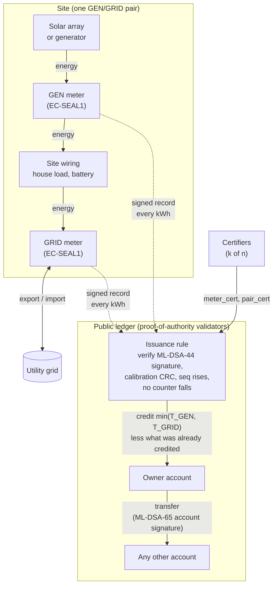
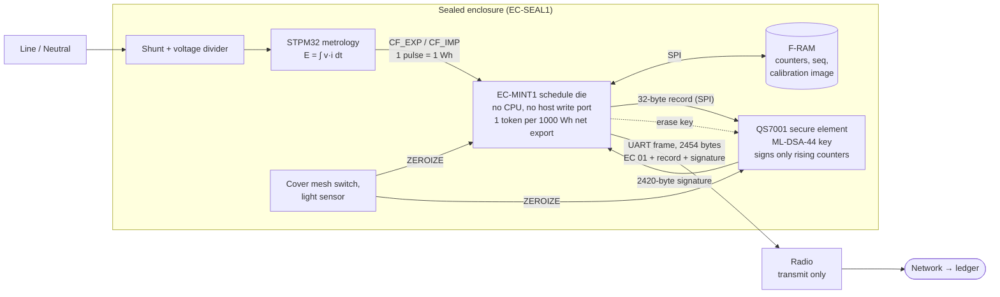

# Enerchain

**Power is the new gold.**

Release: **v0.0.1** (documentation edition doc-1.3, 2026-10-09). See [CHANGELOG.md](CHANGELOG.md).

## In plain language

Enerchain is a proposal for an electricity currency. Coins are created when hardware measures power delivered to a grid. The count of coins is locked to the electrical reading — voltage, current, and time — and the reading is signed. Anyone can transfer the coins on a public ledger, and the signer cannot later deny the signature.

The reason to denominate money this way is the direction of the technical economy. Compute and the machines around it run on electricity, and more of that load is arriving. Generation is spreading outward: a home array can feed a feeder, not only a central station. Proof-of-work mining already spends electricity to make a coin. Enerchain spends the opposite direction: the coin records electricity contributed.

Grids already trade power between regions. The same unit is the proposed trade good when the region is a planet or a solar system.

## How it works

### Plain language

A site has two sealed meters. One sits at the solar array or generator, the other where the site connects to the grid. Each meter counts energy in both directions and makes one token for every kilowatt-hour that leaves for the grid, after subtracting what came in. Each token is a signed record. A public ledger checks the signatures and pays the site owner the smaller of the two meters' counts. After that, tokens move between accounts like any other public-ledger asset.

### The whole system

- **Two meters, one minimum.** The GEN meter shows the energy was generated. The GRID meter shows it left the site, net of what came in. The ledger credits `min(T_GEN − base_GEN, T_GRID − base_GRID)`, so one meter cannot mint alone.
- **Cumulative records.** Every record carries running totals, so a late or lost record costs nothing; the next one carries the totals. A replayed record fails the `seq` check.
- **Net export only.** A battery that buys from the grid at night and sells back at noon does not raise the net-export high-water mark, so it mints nothing.

### Inside one sealed meter

EC-MINT1 is the only SPI master the signer and the F-RAM ever see. The radio cannot write back, so nothing outside the die can set a counter or choose what gets signed. Opening the cover while the meter is powered erases the key; opening it while unpowered is not yet detected (open item O-1). The chip is specified in [hardware/asic/spec.md](hardware/asic/spec.md), and the board wiring is [docs/schematics/mint-path.svg](docs/schematics/mint-path.svg).

## Technical statement

Issuance is Proof of Generation. A meter integrates active energy, \(E = \int v(t)\, i(t)\, dt\), in both directions, and mints one token per 1000 Wh (1 kWh) of net export, inside the seal. Every token is signed as it is minted: a certified pair of meters, one at the generator terminals and one at the grid connection, signs a cumulative record for each kilowatt-hour; the ledger credits the smaller of the two hardware token counts. The ledger is public. Transfer is a signed transaction. Non-repudiation is the device signature over the generation record and the account signature over the spend.

Proof-of-work orders history by hashing and consumes large amounts of electricity to do it [de Vries 2018]. Enerchain does not use that expenditure as the mint. Injection into the grid is the mint, as NRGcoin proposed for renewable injection [Mihaylov et al. 2014]. Households and other small agents that both consume and produce are the prosumer case already described in the market-design literature [Parag and Sovacool 2016]. Price still varies by region, which wholesale markets already do [Schweppe et al. 1988; Hogan 1992].

## Design goals

- Hardware-locked issuance from voltage, current, and time.
- Coins only for energy the meters accepted as delivered to the grid, net of energy taken from it.
- Public ledger, easy transfer, non-repudiation.
- Individuals and larger plants on the same evidence rule.
- One measurement language from a feeder to a planetary region.

## Worked example

A home array delivers 10 kWh more to the grid than the house takes from it. The GRID meter at the connection counts 10 000 export pulses net of import and mints 10 tokens inside the seal, one per 1000 pulses (1 kWh); the GEN meter at the array terminals counts what the panels produced. Each meter signs a cumulative record for every token, so each kilowatt-hour reaches the ledger on its own. The ledger checks both signatures and credits min(GEN tokens, GRID tokens) to the owner's account, one token per kilowatt-hour. The holder transfers them with an account signature. A battery that buys from the grid at night and sells back at noon mints nothing.

## Status

v0.0.1 is the first version with software you can run:

- **Ledger, wallet and devnet** in Python (`enerchain/`), with the issuance rule, k-of-n meter certification, transfers and proof-of-authority blocks. `pip install -e '.[test]' && pytest && enerchain demo`. See [docs/software.md](docs/software.md).
- **EC-MINT1 RTL** that simulates end to end (provisioning, net-export minting, power cuts, signer refusal, zeroize) and matches the Python meter model byte for byte.
- **QS7001 signing image** with one-time keygen, a persistent wipe and a rollback guard, unit-tested on the host.
- **EC-SEAL1 revision B** board files from `tools/gen_board.py`, after an electrical review that found the doc-1.1 board could not have worked: [docs/electrical-review.md](docs/electrical-review.md).

Nothing has been built or taped out. Revision B is a bench prototype: opening the cover while the meter is unpowered is not yet detected. [docs/open-items.md](docs/open-items.md) lists that and every other assumption still to verify. There is still no GDSII.

## Documents

Start with [docs/how-to.md](docs/how-to.md). It is the reading order, the software setup, and the build. The claim itself is in [docs/hypothesis.md](docs/hypothesis.md). Sources are in [docs/references.md](docs/references.md).

| Document | Question it answers |
| --- | --- |
| [Hypothesis](docs/hypothesis.md) | What is being proposed? |
| [Problem statement](docs/problem-statement.md) | Why an electricity currency? |
| [Whitepaper](WHITEPAPER.md) | How issuance and transfer work? |
| [Solution](SOLUTION.md) | Why hardware, and what changed in v0.0.1? |
| [Energy verification](docs/energy-verification.md) | How is the hardware lock specified? |
| [Hardware binding](docs/hardware-binding.md) | How does the sealed integral sign the token? |
| [Ledger nonrepudiation](docs/ledger-nonrepudiation.md) | How does that signature become a public, quantum-resistant record? |
| [Meter burden](docs/meter-burden.md) | How little electricity may the mint path use? |
| [Electrical review](docs/electrical-review.md) | What was wrong with the doc-1.1 board, and what revision B does instead? |
| [Threat model](docs/threat-model.md) | Who might mint falsely, and what stops them? |
| [Open items](docs/open-items.md) | What is assumed, unverified, or not built? |
| [Software](docs/software.md) | How do I run the ledger, wallet and devnet? |
| [Schematic](docs/schematics/mint-path.svg) | The revision B mint path on one page. |
| [Circuit sheets](docs/schematics/README.md) | IEC-symbol circuits of revision B, with the design values computed. |
| [Sign datapath](docs/schematics/crypto-datapath.md) | Doc-0.8 cryptography sketch. Not the tapeout. |
| [EC-SEAL1](hardware/fab/ec-seal1/MANUFACTURER.md) | Board order, revision B. Parts, pours, netlist. |
| [Fab notes](hardware/fab/FAB-NOTES.md) | Do not build the doc-0.9 BOM. |
| [EC-MINT1](hardware/asic/README.md) | Chip handoff. Not GDSII. |
| [Economics](docs/economics.md) | Who generates, and how do regions trade? |
| [Interplanetary economics](docs/interplanetary-economics.md) | What does a planetary region prove? |
| [Governance](docs/governance.md) | Who may change the rules? |
| [Roadmap](ROADMAP.md) | What comes next, in phases? |
| [Contributing](CONTRIBUTING.md) | How to propose a change? |
| [AGENTS.md](AGENTS.md) | How do coding agents set up, check, and change the repository safely? |

## Licensing

This repository uses two licenses, split by content:

| Path | License | File |
| --- | --- | --- |
| `enerchain/`, `firmware/`, `tools/`, `tests/`, `docs/`, and the top-level documents | Apache-2.0 | [LICENSE](LICENSE) |
| `hardware/` (EC-SEAL1 board files, EC-MINT1 RTL and chip handoff) | CERN-OHL-S-2.0 | [LICENSE-HARDWARE](LICENSE-HARDWARE) |

Apache-2.0 is permissive and includes a patent grant. CERN-OHL-S-2.0 is a strongly reciprocal hardware license: anyone who distributes or manufactures a design derived from `hardware/` must make their modified design files available under the same license. See [NOTICE](NOTICE) for the SPDX identifiers.
